<!-- GENERATED by tools/views.py — never hand-edit; features.md and reqs/ are truth -->

# Feature Map — #Solving — generated

Feature tree (from features.md) with attached REQs. Dashed red = inferred REQ; thick green = BIZ; grey = withdrawn; dashed blue = idea. `realizes` edges are drawn inside a top-level feature only; cross-area ones are listed below the map. Purple = ai-approved: released by the agent for a prototype, not signed off.

```mermaid
flowchart LR
  subgraph sg_Solving ["#Solving — Solving a puzzle"]
    Solving["#Solving"]:::featAi
    REQ-002["REQ-002 (BIZ)<br/>Classic tangram for school-age players"]:::bizAi
    Board["#Board"]:::featAi
    REQ-011["REQ-011 (FUN)<br/>Empty silhouette board"]:::funAi
    Tray["#Tray"]:::featAi
    REQ-012["REQ-012 (FUN)<br/>The puzzle's pieces in a fixed tray"]:::funAi
    REQ-013["REQ-013 (UI)<br/>Tray miniatures share one scale"]:::uiAi
    SizeMarks["#SizeMarks"]:::featAi
    REQ-043["REQ-043 (UI)<br/>Size marks on the tray triangles"]:::uiAi
    Drag["#Drag"]:::featAi
    REQ-014["REQ-014 (FUN)<br/>Drag and drop a piece"]:::funAi
    REQ-015["REQ-015 (FUN)<br/>Tap or drag, and touch areas"]:::funAi
    Turning["#Turning"]:::featAi
    TapTurn["#TapTurn"]:::featAi
    REQ-016["REQ-016 (FUN)<br/>Tap to turn 45°"]:::funAi
    TwistTurn["#TwistTurn"]:::featAi
    REQ-017["REQ-017 (FUN)<br/>Two-finger twist in 45° steps"]:::funAi
    TurnButtons["#TurnButtons"]:::featAi
    REQ-044["REQ-044 (UI)<br/>Turn buttons in the tray"]:::uiAi
    Flip["#Flip"]:::featAi
    REQ-018["REQ-018 (FUN)<br/>Mirror the parallelogram"]:::funAi
    Locking["#Locking"]:::featAi
    AnchorLock["#AnchorLock"]:::featAi
    REQ-019["REQ-019 (FUN)<br/>Lock to corners and neighbours"]:::funAi
    GoHome["#GoHome"]:::featAi
    REQ-020["REQ-020 (FUN)<br/>Missed drop returns to the tray"]:::funAi
    LandingPreview["#LandingPreview"]:::featAi
    REQ-021["REQ-021 (UI)<br/>Landing preview"]:::uiAi
    SolvedCheck["#SolvedCheck"]:::featAi
    REQ-022["REQ-022 (FUN)<br/>Any exact cover solves the puzzle"]:::funAi
    SolvedPicture["#SolvedPicture"]:::featAi
    REQ-023["REQ-023 (FUN)<br/>Solved picture"]:::funAi
  end
  Solving --> REQ-002
  Solving --> Board
  Board --> REQ-011
  Solving --> Tray
  Tray --> REQ-012
  Tray --> REQ-013
  Solving --> SizeMarks
  SizeMarks --> REQ-043
  Solving --> Drag
  Drag --> REQ-014
  Drag --> REQ-015
  Solving --> Turning
  Turning --> TapTurn
  TapTurn --> REQ-016
  Turning --> TwistTurn
  TwistTurn --> REQ-017
  Turning --> TurnButtons
  TurnButtons --> REQ-044
  Turning --> Flip
  Flip --> REQ-018
  Solving --> Locking
  Locking --> AnchorLock
  AnchorLock --> REQ-019
  Locking --> GoHome
  GoHome --> REQ-020
  Locking --> LandingPreview
  LandingPreview --> REQ-021
  Solving --> SolvedCheck
  SolvedCheck --> REQ-022
  Solving --> SolvedPicture
  SolvedPicture --> REQ-023
  REQ-011 -.->|realizes| REQ-002
  REQ-012 -.->|realizes| REQ-002
  REQ-013 -.->|realizes| REQ-012
  REQ-014 -.->|realizes| REQ-002
  REQ-015 -.->|realizes| REQ-002
  REQ-016 -.->|realizes| REQ-002
  REQ-017 -.->|realizes| REQ-002
  REQ-018 -.->|realizes| REQ-002
  REQ-019 -.->|realizes| REQ-002
  REQ-020 -.->|realizes| REQ-002
  REQ-021 -.->|realizes| REQ-019
  REQ-022 -.->|realizes| REQ-002
  REQ-023 -.->|realizes| REQ-002
  REQ-043 -.->|realizes| REQ-012
  REQ-044 -.->|realizes| REQ-002
  classDef feat fill:#1f6feb,color:#fff,stroke:#1f6feb
  classDef featIdea fill:#dbe4f3,color:#24292f,stroke:#1f6feb,stroke-dasharray: 4 3
  classDef featSpec fill:#0d5c2f,color:#fff,stroke:#0d5c2f
  classDef featLock fill:#238636,color:#fff,stroke:#0d3d1c,stroke-width:3px
  classDef biz fill:#238636,color:#fff,stroke:#0d3d1c,stroke-width:3px
  classDef fun fill:#eef2f6,color:#24292f,stroke:#57606a
  classDef ui fill:#fff8c5,color:#24292f,stroke:#9a6700
  classDef bizInf fill:#238636,color:#fff,stroke:#cf222e,stroke-dasharray: 5 5
  classDef funInf fill:#eef2f6,color:#24292f,stroke:#cf222e,stroke-dasharray: 5 5
  classDef uiInf fill:#fff8c5,color:#24292f,stroke:#cf222e,stroke-dasharray: 5 5
  classDef withdrawn fill:#f6f8fa,color:#8c959f,stroke:#8c959f,stroke-dasharray: 2 2
  classDef featAi fill:#8250df,color:#fff,stroke:#8250df
  classDef bizAi fill:#238636,color:#fff,stroke:#8250df,stroke-width:3px
  classDef funAi fill:#eef2f6,color:#24292f,stroke:#8250df,stroke-width:2px
  classDef uiAi fill:#fff8c5,color:#24292f,stroke:#8250df,stroke-width:2px
```

## Cross-area realizes (not drawn)

- none
