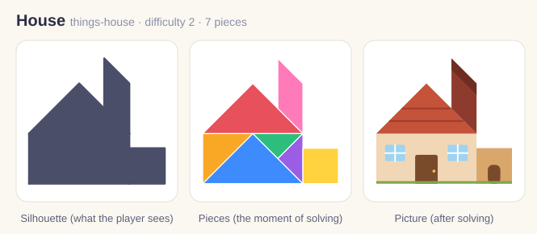
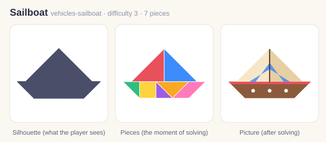

# Picture changes: changed since the build you last played

*WO-009, TASK-091-0, 2026-10-05. For Jami. Nothing here needs your answer; it is the list of what moved.*

REQ-039 says a picture uses 3 to 8 colours. Until now the rule was only information; the validator now checks it (rule **V14**, DA-162). The count is the number of distinct *visible* colours: the base, every fill and every stroke, and a see-through tint over the base counts as one more colour.

Two of the 13 pictures were over the limit. Only their pictures (`art`) changed. The puzzle itself (the seven pieces, the outline), the titles, the rating, the kind and the review flag are untouched; the solutions are byte-for-byte the same.

| Puzzle | Colours before | Colours after | Change |
|---|---|---|---|
| House (`things-house`) | 11 | 8 | The two roof lines now use the chimney red (`#8E3B2E`) instead of their own darker red. The darker shade stripe on the chimney is gone (it would be the same colour as the chimney). The door knob is the garage-wall tan (`#D9A66B`) instead of gold. |
| Sailboat (`vehicles-sailboat`) | 9 | 8 | The right-hand blue stripe on the sail is drawn at the same tint strength (0.85) as the left-hand one; before it was lighter (0.6). |

The other 11 pictures were already inside the rule (3 to 8) and did not change.

## House

Before:

After:

## Sailboat

Before:

After:

The sheets show silhouette, pieces and picture; the picture is the right-hand third. All 13 pictures are still unreviewed AI drafts (`reviewedByHuman: false`).
